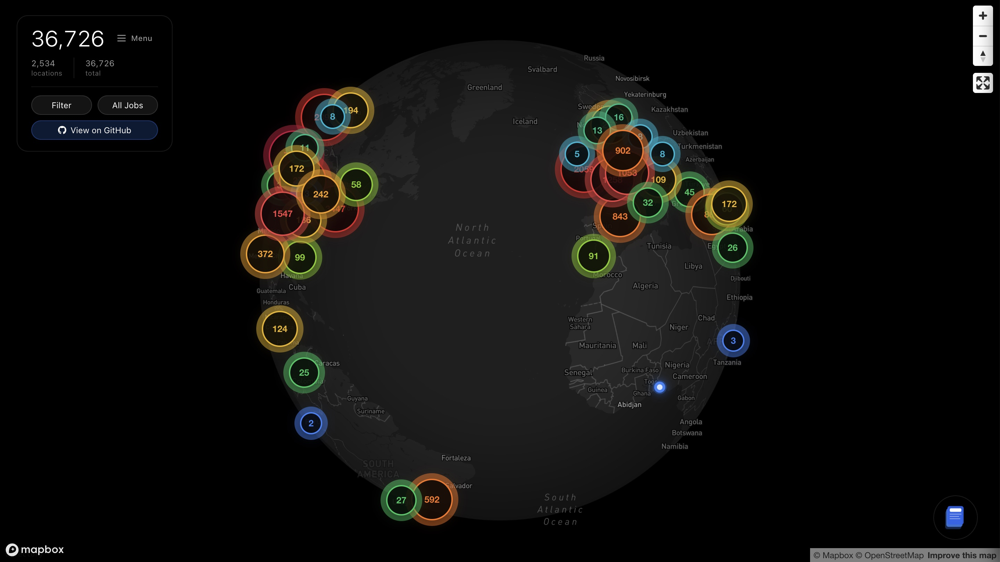

<div align="center">
  
</div>

A dark-mode interactive map for exploring job opportunities from tech companies worldwide. Built with **Next.js**, **React**, **TypeScript**, and **Mapbox GL**.

It helps you discover jobs from leading tech companies like OpenAI, Anthropic, Google, Apple, Microsoft, and more. Filter by location, company, and job title with filters or discuss with the built-in assistant.



[View demo](https://twitter.com/kalil0321/status/1992360484780253555)

## Setup

### 1. Prerequisites

- Node.js 18+ (LTS recommended)
- npm (comes with Node)

### 2. Get a Mapbox Token

1. Sign up for a free account at [Mapbox](https://www.mapbox.com/)
2. Create an access token from your account dashboard
3. Copy the token

### 3. Configure Environment

Create a local env file from the example:

```bash
cp env.example .env.local
```

Edit `.env.local` and set at least:

```bash
NEXT_PUBLIC_MAPBOX_TOKEN=pk.eyJ1IjoieW91ciIsImEiOiJ0b2tlbiJ9...
NEXT_PUBLIC_BASE_URL=http://localhost:3000
```

Optional variables:

- `MISTRAL_API_KEY` – enables the AI assistant for search and explanations

### 4. Install Dependencies

From the `map` directory:

```bash
npm install
```

### 5. Run Development Server

```bash
npm run dev
```

The app will be available at `http://localhost:3000`.

## Contributing

Contributions! Here's how you can help:

- **Suggest Companies**: Found a tech company that should be on the map? [Open an issue](https://github.com/kalil0321/map/issues) and let us know!
- **Request Features**: Have ideas for new features or improvements? Share them in the [issues](https://github.com/kalil0321/map/issues).

Your feedback and contributions help make this project better for everyone.

## License

MIT
